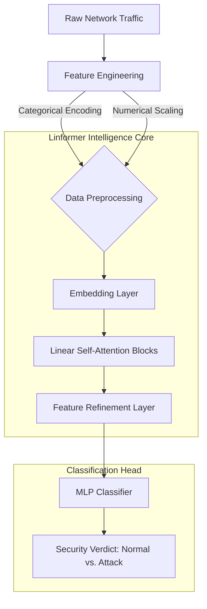

# 🛡️ Transformer-Based Network Intrusion Detection System (IDS)

**Transformer-Based IDS** is a high-performance cybersecurity framework designed to identify malicious network traffic using the **Linformer** architecture[cite: 4, 5]. By leveraging self-attention mechanisms with linear complexity, this system provides a scalable solution for real-time threat detection in high-throughput network environments

---

## 🚩 The Challenge: "Security at Scale"
Traditional Intrusion Detection Systems often struggle with:
*   **Modern Attack Complexity**: Conventional machine learning models frequently fail to capture the long-range dependencies and subtle patterns present in modern polymorphic attacks
*   **Computational Overhead**: Standard Transformer models have $O(n^2)$ complexity, making them too slow for high-speed network packet analysis
*   **Dataset Drift**: Models trained on older datasets often fail to generalize to new network environments and attack vectors

---

## 🏗️ System Architecture & Logic Flow

The system utilizes a **Decoupled Deep Learning Pipeline** that processes raw network metadata into binary security classifications

### Technical Architecture

[cite: 4]

---

## 💡 The Approach: "Linear Complexity Transformers"
1.  **Efficient Attention (Linformer)**: Unlike standard Transformers, this project implements **Lightweight Attention** modules By projecting the keys and values into a lower-dimensional space, the model achieves **linear time and space complexity**, crucial for real-time IDS
2.  **Cross-Dataset Validation**: The model is trained on **UNSW-NB15** (featuring modern traffic) and rigorously validated against **NSL-KDD** to ensure the system remains robust against dataset shift
3.  **Balanced Optimization**: Implements **Balanced Class Weights** and **autocast mixed precision** training to handle the inherent class imbalance of network data while maximizing GPU throughput

---

## 🔑 Key Features
*   **Linformer Backbone**: 2-layer optimized Transformer architecture with a 128-dimensional latent space
*   **Robust Preprocessing**: Automated handling of categorical features (Protocol, Service, State) and feature scaling for consistency
*   **Generalization Performance**: Demonstrated ability to maintain a **74% accuracy** on entirely unseen datasets (NSL-KDD) without fine-tuning
*   **High Fidelity Results**: Achieves a **0.90 F1-score** on the UNSW-NB15 test set, minimizing false negatives in critical security scenarios

---

## 🚀 Installation & Usage

### 1. Requirements
*   Python 3.10+
*   PyTorch (with CUDA support for acceleration)
*   Pandas, Scikit-learn, Seaborn

### 2. Quick Setup
```bash
git clone https://github.com/arjunrd07/Transformer-Based-Network-Intrusion-Detection-System
cd Transformer-Based-Network-Intrusion-Detection-System
pip install torch pandas scikit-learn matplotlib seaborn
```
[cite: 4]

### 3. Execution
The system is provided as a modular notebook for easy experimentation
1. Place `UNSW_NB15_training-set.parquet` and `UNSW_NB15_testing-set.parquet` in the directory
2. Run the training cells to initialize the **LinformerIDS** model and start the optimization loop

---

## 🎯 Primary Conclusion
This project demonstrates that **Linear Transformers** are a highly viable alternative to traditional RNNs and CNNs for network security. By reducing the complexity of the self-attention mechanism, we provide a path toward **Deep Learning-powered hardware firewalls** that can process traffic at line speed while maintaining high detection accuracy[cite: 4, 5].

---

## 🔮 Future Works
*   **Multi-Class Classification**: Expanding from binary detection to specific attack identification (DDoS, Backdoor, Fuzzing)
*   **Real-time Packet Ingestion**: Integrating with `Scapy` or `DPDK` for live network monitoring
*   **Explainable AI (XAI)**: Using attention maps to visualize exactly which network features triggered an "Attack" verdict
